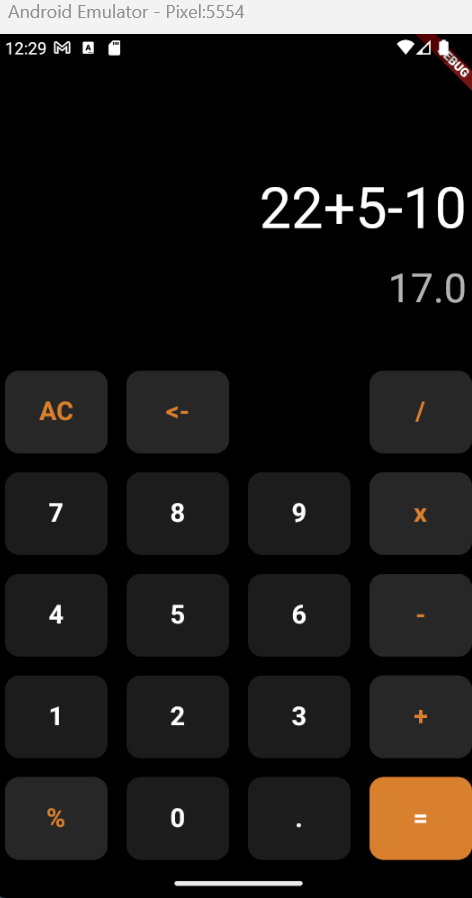
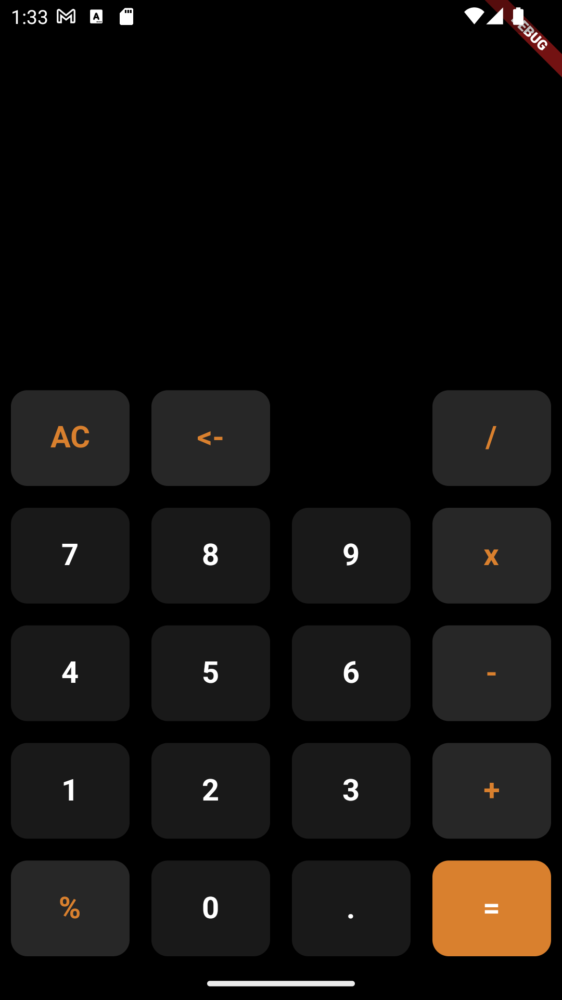

# 🔢 Calculator Flutter Project

A simple calculator app that can perform basic arithmetic operations like addition, subtraction, multiplication, or division, depending on user input. The app is built using Flutter, a cross-platform framework for building mobile applications.

## 🌟 Introduction 
The Calculator Flutter Project is a basic calculator app developed using Flutter. It provides a user-friendly interface for performing arithmetic calculations on a mobile device. With this calculator app, users can easily perform addition, subtraction, multiplication, and division operations.

The app utilizes the `math_expressions` package, which handles all the calculations and runtime error exceptions. This package simplifies the process of evaluating mathematical expressions and ensures accurate results.


## 📌 Features

**_The Calculator Flutter Project offers the following features:_**

- **Addition:** Perform addition operations by entering two numbers and pressing the "+" button.
- **Subtraction:** Perform subtraction operations by entering two numbers and pressing the "-" button.
- **Multiplication:** Perform multiplication operations by entering two numbers and pressing the "x" button.
- **Division:** Perform division operations by entering two numbers and pressing the "/" button.
- **Modulus:** Perform modulus operations by entering two numbers and pressing the "%" button.
- **Error Handling:** The app handles runtime errors, such as dividing by zero or entering invalid mathematical expressions, providing a smooth user experience. On diving a number by zero gives output `Infinity`.


## 📸 Screenshots





## 👉 Prerequisites

Before running this project, make sure you have the following prerequisites set up on your system:
1. **Flutter SDK:** Follow the official Flutter installation guide to install Flutter on your machine: [Flutter Installation](https://flutter.dev/docs/get-started/install)
2. **Dart SDK:** Flutter relies on the Dart programming language, so make sure you have Dart SDK installed. It is typically installed automatically with Flutter.
3. **VS Code:** Download and install Visual Studio Code from the official website: [VS Code](https://code.visualstudio.com/) .

## ⬇️ Installation

### Clone the Repository:

```bash
git clone https://github.com/Arpitaagupta/Calculator-Flutter-Project.git
```


1.  **Open the Project in VS Code:**

* Launch Visual Studio Code.
* Click on `"File"` in the top menu and select `"Open Folder"`.
* Browse to the directory where you cloned the * repository and select the `"Calculator-Flutter-Project"` folder.
* The project will now open in VS Code.

2. **Install Dependencies:**

* Open the integrated terminal in VS Code by going to `"View"` in the top menu and selecting "Terminal" or by using the shortcut Ctrl+`` (backtick key).``
* Make sure the terminal's current directory is the root of your project.
* Run the following command to install the project dependencies:
```
flutter pub get
```

#### (i) Connect Your Device or Emulator:
* Connect your physical device to your computer via USB or start an emulator.
* Ensure that your device or emulator is detected by running the following command in the terminal:
``` 
flutter devices
```

#### (ii) Run the App:
* In the terminal, run the following command to start the app on your connected device or emulator:
```
flutter run
```
* Flutter will compile the code, build the app, and launch it on your device or emulator. You should be able to see and interact with your Flutter calculator app.


## 💁‍♀️ Concepts Used :
_Here are some concepts used while developing the project :_

* [Widgets](#widgets)
* [Stateful Widgets](#stateful-widgets)
* [Material Design](#material-design)
* [Event Handling](#event-handling)
* [Math Expressions Evaluation](#math-expressions-evaluation)
* [Scaffold](#scaffold)
* [Children](#children)
* [Optional Parameters](#optional-parameters)

* ### Widgets:
 In Flutter, widgets are the building blocks of the user interface. Widgets define the structure and appearance of your app. The CalculatorApp widget is the root widget of the app, and it contains other widgets that define the UI components.

* ### Stateful Widgets:
 The app uses Stateful Widgets to manage and update the state of the calculator app.

* ### Material Design: 
The app follows the principles of Material Design for its user interface, providing a modern and intuitive look and feel.

* ### Event Handling:
The app handles button clicks and performs appropriate actions based on the user's input.

* ### Math Expressions Evaluation:
The app utilizes the **math_expressions** package to evaluate mathematical expressions and calculate the result.

* ### Scaffold:
Scaffold is a widget provided by the Flutter framework that implements the basic material design visual layout structure. It provides common visual elements such as app bars, navigation drawers, and bottom navigation bars. In the calculator app, the Scaffold widget is used as the main container for the app's UI.

* ### Children:  
In Flutter, the children property is commonly used to specify a list of child widgets that should be rendered inside a parent widget. For example, the Column widget in the calculator app uses the children property to define a list of rows, each containing buttons.

* ### Optional Parameters: 
In Dart, you can define optional parameters for functions and constructors by enclosing them in square brackets ([]). Optional parameters can be omitted when calling the function or constructor, and they have default values assigned to them. In the calculator app, optional parameters are used in the button widget to customize the appearance and behavior of the buttons.

## 🤝 Contributing
Contributions are welcome!🤗 If you find any bugs or want to add new features, feel free to open an issue or submit a pull request. 


## 🪪 License
This project is licensed under the [MIT License](https://github.com/git/git-scm.com/blob/main/MIT-LICENSE.txt) .

Feel free to copy and paste the updated `README.md` code block to your file, including the added information about widgets, Scaffold, children, and optional parameters in Dart.
